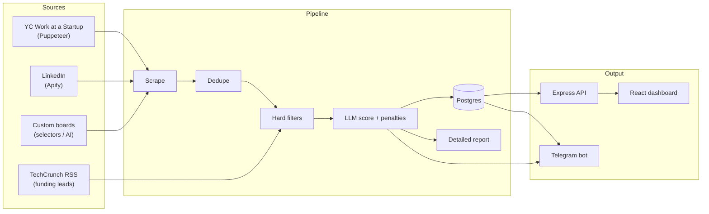

# Job Agent

[](https://github.com/aerrarhiche/job-hunter/actions/workflows/ci.yml)

An autonomous job-search agent that scrapes startup job boards, scores every
listing against your resume and preferences using an LLM, and surfaces the best
matches — with a daily Telegram brief and a live React dashboard.

Built for a very specific search: a remote **Founding / Full-Stack / Product
Engineer** looking at seed–Series A startups. Everything is configurable, so it
generalizes to any target role, stack, salary band, or industry.

---

## Features

- **Multi-source scraping**
  - Y Combinator "Work at a Startup" (headless Puppeteer login + two parallel search flows)
  - LinkedIn (via the Apify "LinkedIn Jobs Scraper" actor)
  - Arbitrary job boards via a self-configuring custom scraper (CSS selectors or AI page analysis)
  - TechCrunch venture RSS for fresh funding leads
- **LLM scoring & review** (DeepSeek) — a fast pass plus a detailed
  category-by-category report, hard penalties enforced programmatically on top
  of the model, company research from the web, deep fit reviews, cover letters,
  and tailored resumes.
- **Deduplication & filtering** — by URL, keyword blacklist, role/tech match,
  location, remote policy, and salary floor.
- **Postgres persistence** — jobs, decisions, scout-run history, audit logs, and
  a skill-gap tracker ("Level Up").
- **Telegram bot** — daily brief plus quick actions (`/tailor`, `/skip`,
  `/tailor_url`).
- **React dashboard** — stats, sortable/filterable job table, live pipeline
  view, scraper management, search config, and skill-gap tracking.

## Architecture



The pipeline runs on a daily cron (default `07:00` UTC), and every step writes
audit logs so the dashboard can visualize a run as it happens.

### Scoring

Jobs are scored 0–100 against `resume/master.md` and the preferences in
`resume/soul.md`, across six weighted categories:

| Category           | Max | Notes                                           |
| ------------------ | :-: | ----------------------------------------------- |
| Role match         | 30  | Target titles only; non-target roles capped low |
| Tech-stack overlap | 25  | Match against your preferred stack              |
| Company stage/size | 15  | Seed/Series A preferred; enterprise penalized   |
| Domain relevance   | 10  | Bonus for your target industries                |
| Remote policy      | 10  | Remote required; on-site/relocation penalized   |
| Salary             | 10  | Floor enforced; bonus above target              |

Hard penalties (crypto, Go/Rust/Kafka/K8s-primary, on-site, EU-only, 10+ YOE,
large enterprise, non-target roles) are re-applied **programmatically** in
`src/agent/pipeline.ts`, because the LLM is not trusted to remember them.

## Tech stack

- **Backend** — TypeScript, Node.js, Express, `pg`
- **LLM** — DeepSeek (OpenAI-compatible SDK)
- **Scraping** — Puppeteer, Cheerio, Axios, Apify
- **Scheduling** — `node-cron`; **Messaging** — Telegram Bot API
- **Frontend** — React 18, Vite, Tailwind CSS v4, TanStack Query, Radix UI
- **Database** — PostgreSQL 16

## Repository layout

```
job-agent/
├─ src/
│  ├─ index.ts            # cron + scout orchestration
│  ├─ config.ts           # env-driven config, resume/soul loaders
│  ├─ agent/              # LLM scoring, research, two-pass pipeline
│  ├─ scrapers/           # yc, linkedin, custom, techcrunch
│  ├─ api/                # Express server + REST routes
│  ├─ db/                 # pg client, schema.sql, migrate.ts
│  ├─ telegram/           # bot commands + daily brief
│  └─ dashboard/          # React + Vite frontend (separate package)
├─ resume/                # gitignored inputs + committed examples/README
├─ Dockerfile
├─ docker-compose.yml
└─ .env.example
```

## Getting started

### Prerequisites

- Node.js 22+
- Docker (recommended) **or** a local PostgreSQL 16 instance
- A [DeepSeek API key](https://platform.deepseek.com/)
- Optional: Telegram bot token + chat id, an [Apify](https://apify.com) token,
  and Y Combinator account credentials

### Option A — Docker (recommended)

```bash
cp .env.example .env          # then fill in real values
docker compose up -d --build  # Postgres + agent; API on http://localhost:3001
```

To run the dashboard against the Docker backend:

```bash
cd src/dashboard
npm install
npm run dev                   # http://localhost:5173 (proxies /api → :3001)
```

### Option B — Local development

```bash
npm install
cp .env.example .env          # fill in real values
npm run db:migrate            # apply schema.sql
npm run dev                   # API + cron + telegram on http://localhost:3000
```

Run the dashboard (in a second terminal) with a proxy pointed at the local API
(edit `src/dashboard/vite.config.ts` target to `http://localhost:3000`).

Useful scripts:

| Script               | Description                                    |
| -------------------- | ---------------------------------------------- |
| `npm run dev`        | Watch-mode backend (tsx)                       |
| `npm run build`      | Compile TypeScript to `dist/`                  |
| `npm run scout`      | Run a single scout pass immediately, then exit |
| `npm run telegram`   | Run just the Telegram bot                      |
| `npm run db:migrate` | Apply `schema.sql`                             |

## Configuration

All configuration lives in environment variables (see `.env.example`). At
runtime, search preferences are overridable from the dashboard and persisted in
the `search_config` table.

| Variable                                  | Purpose                                             |
| ----------------------------------------- | --------------------------------------------------- |
| `DEEPSEEK_API_KEY`                        | LLM API key                                         |
| `TELEGRAM_BOT_TOKEN` / `TELEGRAM_CHAT_ID` | Daily brief + quick actions                         |
| `APIFY_TOKEN`                             | LinkedIn scraping via Apify                         |
| `YC_EMAIL` / `YC_PASSWORD`                | Y Combinator login                                  |
| `POSTGRES_*`                              | Database connection                                 |
| `DAILY_RUN_HOUR` / `DAILY_RUN_MINUTE`     | Cron schedule (UTC)                                 |
| `SEARCH_*`                                | Role titles, keywords, locations, salary, threshold |
| `API_PORT`                                | Backend HTTP port (default `3000`)                  |

### Resume & preferences

`resume/master.md` (your resume) and `resume/soul.md` (preferences + hard-nos)
are **gitignored** — they are personal inputs, never committed. Copy the
examples to get started:

```bash
cp resume/EXAMPLE-master.md resume/master.md
cp resume/EXAMPLE-soul.md resume/soul.md
```

See [`resume/README.md`](resume/README.md) for the exact formats.

## REST API

| Method              | Route                        | Description                                 |
| ------------------- | ---------------------------- | ------------------------------------------- |
| GET                 | `/api/stats`                 | Dashboard aggregate stats                   |
| GET                 | `/api/jobs`                  | List/filter jobs (source, minScore, status) |
| GET                 | `/api/jobs/:id`              | Job detail + decision history               |
| GET                 | `/api/jobs/:id/report`       | Stored or freshly generated scoring report  |
| POST                | `/api/jobs/:id/review`       | Deep fit review                             |
| POST                | `/api/jobs/:id/cover-letter` | Generate a cover letter                     |
| POST                | `/api/jobs/:id/decide`       | Record a decision (applied/skipped/…)       |
| GET/PUT/POST/DELETE | `/api/scrapers…`             | Manage scrapers                             |
| POST                | `/api/scrapers/:id/trigger`  | Run a single scraper                        |
| POST                | `/api/scrapers/trigger-all`  | Run all active scrapers                     |
| GET/PUT             | `/api/search-config`         | Read/update search preferences              |
| GET                 | `/api/runs`                  | Scout-run history                           |
| GET                 | `/api/audit-logs`            | Live pipeline logs                          |
| GET                 | `/api/level-up`              | Skill-gap tracker items                     |

## Telegram commands

| Command             | Action                                   |
| ------------------- | ---------------------------------------- |
| `/start`            | Show available commands                  |
| `/brief`            | Send the current top matches             |
| `/tailor <job_id>`  | Tailor your resume for a saved job       |
| `/skip <job_id>`    | Dismiss a job                            |
| `/tailor_url <url>` | Quick-score an arbitrary job listing URL |

## Status & roadmap

This is a working personal tool. The Y Combinator and custom scrapers rely on
authenticated sessions and CSS selectors that can change over time; treat
selectors and login flows as breakage points.

## Disclaimer

This project scrapes third-party sites for personal use. Respect each site's
Terms of Service, `robots.txt`, and rate limits before running it yourself.
Use of API credentials (DeepSeek, Apify, Telegram, YC) is entirely your
responsibility — keep them out of version control.

## License

[MIT](LICENSE) © Ayman Errarhiche
