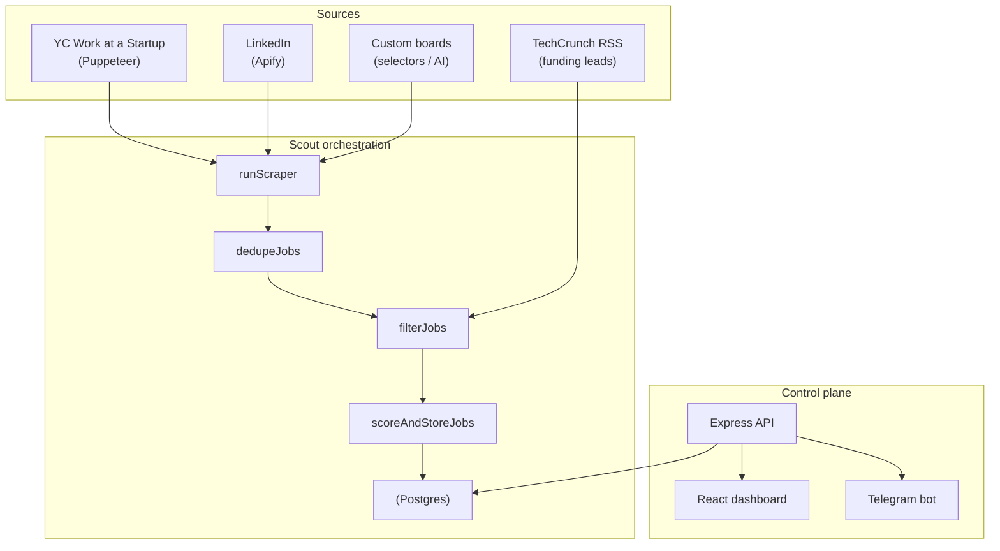

# Architecture

This document describes how Job Agent is structured, how data flows through it,
and the key design decisions. For the rationale behind individual choices, see
the [ADR index](./adr/README.md).

## 1. High-level view

Job Agent is a single long-running Node.js process that performs two jobs:

1. **A scheduled scout** — periodically scrapes startup job boards, deduplicates
   and filters the results, scores every candidate with an LLM, and stores the
   survivors in Postgres.
2. **A control plane** — an Express API plus a React dashboard and a Telegram
   bot that let you inspect results, review/score individual jobs, and steer the
   search (filters, scraper config, learned preferences).



## 2. Runtime components

| Module              | Path                                              | Responsibility                                                             |
| ------------------- | ------------------------------------------------- | -------------------------------------------------------------------------- |
| Scout orchestration | `src/index.ts`                                    | Cron scheduling, top-level pipeline, graceful shutdown                     |
| Scraper dispatch    | `src/scout/run-scraper.ts`                        | `runScraper`, `runSingleScraper`, type → implementation                    |
| Scrapers            | `src/scrapers/`                                   | `yc`, `linkedin`, `custom`, `techcrunch`                                   |
| Agent               | `src/agent/`                                      | LLM scoring, deterministic rules, filtering, research, preference learning |
| Database            | `src/db/`                                         | `pg` pool, queries, `schema.sql`, `migrate.ts`                             |
| API                 | `src/api/`                                        | Express server + REST routes                                               |
| Telegram            | `src/telegram/bot.ts`                             | Daily brief + quick actions                                                |
| Dashboard           | `src/dashboard/`                                  | React + Vite (separate package)                                            |
| Configuration       | `src/config.ts`, `src/env.ts`, `src/constants.ts` | Env loading/validation, shared thresholds                                  |
| Logging             | `src/logger.ts`                                   | `pino` logger with child-logger support                                    |

## 3. Data flow (a scout run)

1. **Load config** — `getSearchConfig()` merges DB overrides onto env defaults
   (`src/index.ts` → `loadSearchConfig`).
2. **Create a run** — `createScoutRun()` and write audit-log rows so the
   dashboard can visualize progress live.
3. **Scrape** — for each active scraper, `runScraper()` dispatches to the right
   implementation and records the outcome.
4. **Dedupe & filter** — pure helpers `dedupeJobs` and `filterJobs`
   (`src/agent/filter.ts`) remove duplicate URLs and drop hard misses (keyword
   blacklist, role/tech match, remote policy, salary floor).
5. **Batch existence check** — `getExistingUrls()` does one `WHERE url = ANY(…)`
   query instead of N round-trips.
6. **Two-pass scoring** — see [`src/agent/pipeline.ts`](../src/agent/pipeline.ts)
   and [ADR-0001](./adr/0001-two-pass-scoring.md): a cheap pass ranks everything
   and applies hard penalties; survivors get a detailed report.
7. **Store** — `insertJob()` persists the job, its score, and the full
   `scoring_report` JSONB.
8. **Notify** — `sendDailyBrief()` surfaces the top matches via Telegram (or
   logs them if no chat is configured).

## 4. Scoring model

The score is a 0–100 number with two layers:

- **LLM scoring** — `scoreJob`/`generateScoringReport` (`src/agent/scorer.ts`)
  ask DeepSeek for a weighted, category-by-category assessment against the
  resume and preferences.
- **Deterministic penalties** — `applyHardPenalties` (`src/agent/scoring-rules.ts`)
  re-applies hard rules (crypto, on-site, EU-only, enterprise, wrong role, …)
  on top of the model. Rationale: [ADR-0002](./adr/0002-programmatic-penalties.md).

The LLM client is abstracted behind an `LlmClient` interface
(`src/agent/llm.ts`) so scoring can be unit-tested with a stub and no network.

## 5. Learning & analytics

- **Preference learning** — user decisions (applied / interviewing / offered)
  are distilled into deterministic preference signals (source, salary band, role
  title, company size) by the pure `learnFromDecision` function
  (`src/agent/learner.ts`), and upserted into the `preferences` table with a
  confidence score.
- **Results funnel** — `getFunnel()` aggregates `jobs` by status into
  scraped → scored → applied → interviewing → offered with conversion rates and
  a per-source breakdown.

## 6. Persistence model

PostgreSQL holds all state. `src/db/schema.sql` is idempotent and is applied via
`npm run db:migrate`. Notable choices:

- `jobs.url` is `UNIQUE` (dedupe key).
- `jobs.metadata` and `jobs.scoring_report` are `JSONB` so scraper-specific and
  LLM-specific fields don't force schema churn. See
  [ADR-0004](./adr/0004-jsonb-metadata.md).
- `audit_logs` has a `UNIQUE(scout_run_id, step)` constraint and upserts on
  progress, giving the dashboard a live view of a run.

## 7. Operability

- **Structured logging** — `src/logger.ts` emits JSON via `pino` in production
  and pretty-printed lines in development.
- **Health endpoint** — `GET /healthz` pings the DB and returns uptime.
- **Graceful shutdown** — `SIGINT`/`SIGTERM` stop the cron job and Telegram
  polling, close the HTTP server, and drain the `pg` pool before exiting.

## 8. Testing & quality gates

Pure logic is extracted into testable modules (`filter`, `scoring-rules`,
`techcrunch`, `custom`, `scorer`, `learner`). CI (`.github/workflows/ci.yml`)
runs typecheck, lint, build, and tests on the backend plus a production build of
the dashboard.

```text
npm run typecheck      # tsc --noEmit
npm run lint           # eslint .
npm run build          # tsc
npm test               # vitest run
npm run format:check   # prettier --check .
```
